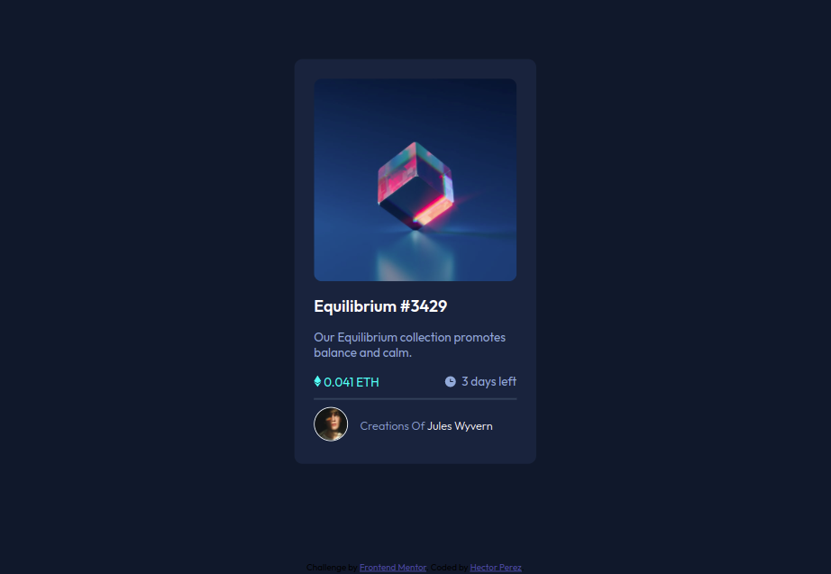
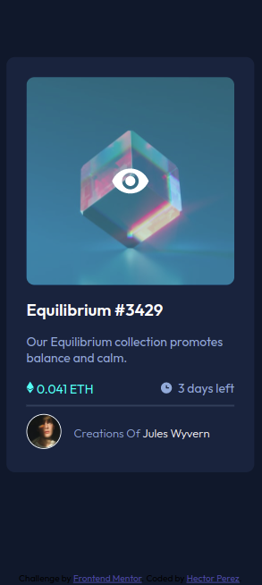

# Frontend Mentor - NFT preview card component solution By Hector Perez

This is a solution to the [NFT preview card component challenge on Frontend Mentor](https://www.frontendmentor.io/challenges/nft-preview-card-component-SbdUL_w0U). Frontend Mentor challenges help you improve your coding skills by building realistic projects. 

## Table of contents

- [Overview](#overview)
  - [The challenge](#the-challenge)
  - [Screenshot](#screenshot)
  - [Links](#links)
- [My process](#my-process)
  - [Built with](#built-with)
- [Author](#author)

**Note: Delete this note and update the table of contents based on what sections you keep.**

## Overview

### The challenge

Users should be able to:

- View the optimal layout depending on their device's screen size
- See hover states for interactive elements

### Screenshot

### Links

- Solution URL: [Add solution URL here](https://github.com/hectorRperez/NFT-preview-card)
- Live Site URL: [Add live site URL here](https://hectorrperez.github.io/NFT-preview-card/)

## My process

### Built with

- Semantic HTML5 markup
- SASS custom properties
- Flexbox
- Mobile-first workflow

## Author

- Website - [Hector Perez Frontend Dev](https://hectorrperez.github.io/portafolio_hector/)
- Frontend Mentor - [@hectorRperez](https://www.frontendmentor.io/profile/hectorRperez)
- Twitter - [@hectorPerezDev](https://twitter.com/hectorPerezDev)
- Github - [@hectorRperez](https://github.com/hectorRperez)
- linkedin - [Hector Perez](https://www.linkedin.com/in/hector-perez-56475ab5/)

